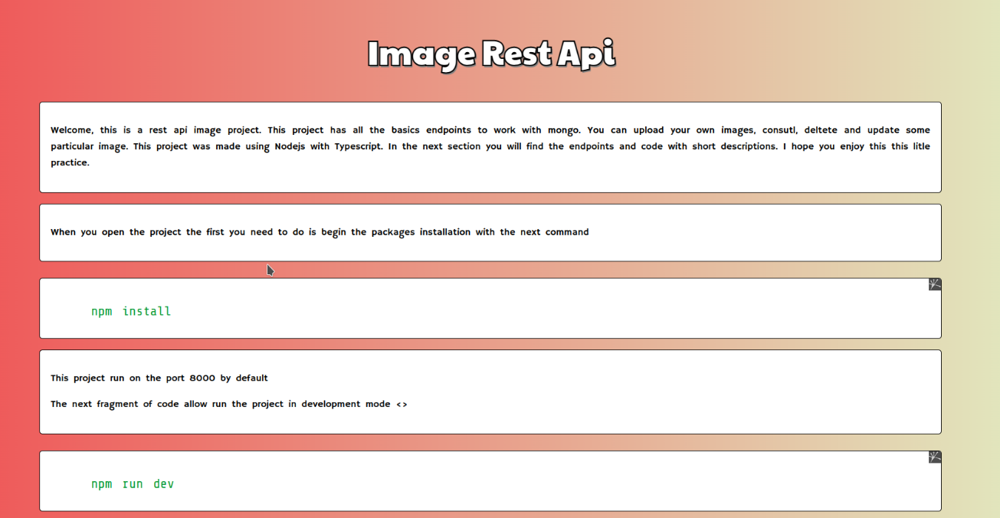
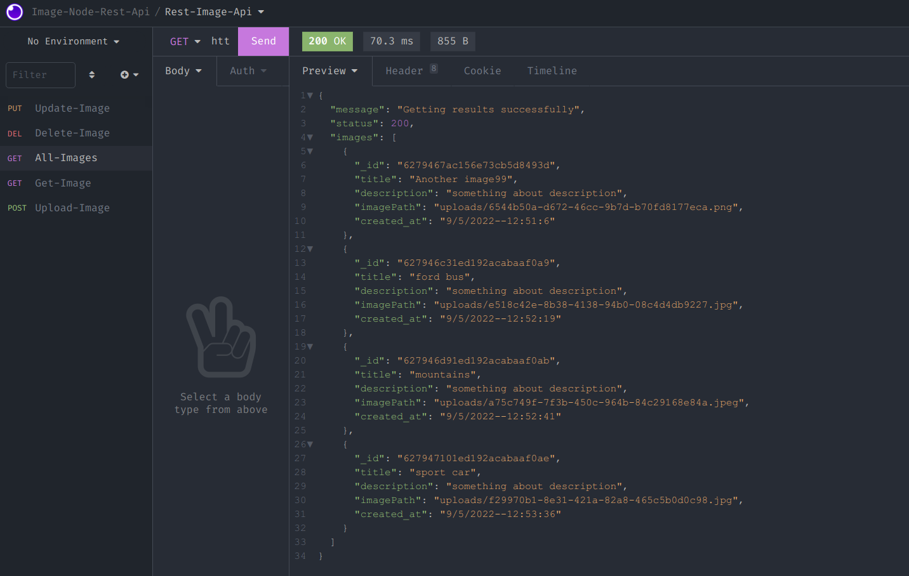
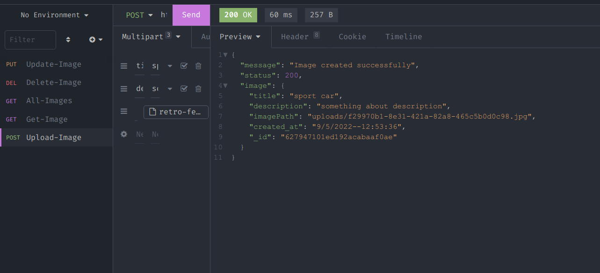
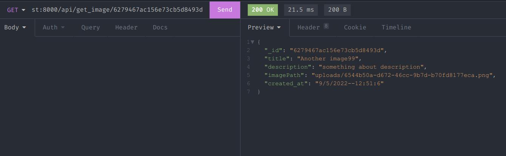
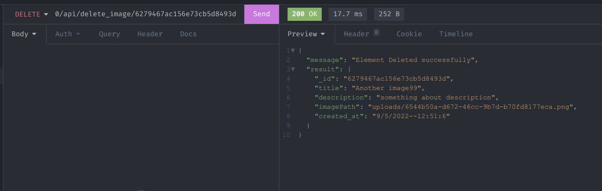
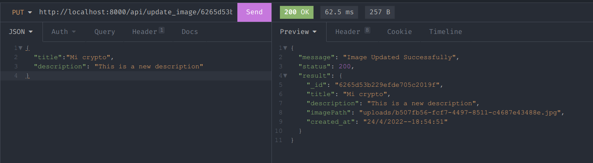

# Rest Image Api - Nodejs - TypeScript - Mongodb

### This is a simple rest api to upload images to the web server. This project was made with Nodejs, Typescript and mongodb. Wirh all the basics endpints using the request models put, post, get and delete


----------------------------------------------------------------
# Installation

### To make a successful  installation type the next commands after clone the github repository

```
npm install
```
### To run the project in development mode
```
npm run dev
```
### To run the project in production mode
```
npm run start
```
### This project has a home page, you can get access only write in url bar of your favorite web browser
```
http://localhost:8000/
```


### Importa you need has to be installed mongodb and running as service

---------

###  To clone the github repository
```
git clone https://github.com/userlg/Rest-Api-Images-Nodejs-Typescript-Mongodb
```
------------

# Screenshot

+ Get all images saved in the server
---------

+ Insert a new image in the server
------------


+ Find an specific image in the server
------



+ Find and delete a specific image in the server

----------



+ Edit and update the data from specific image 
------------




----------------------------------------------------------------
### Created by Userlg